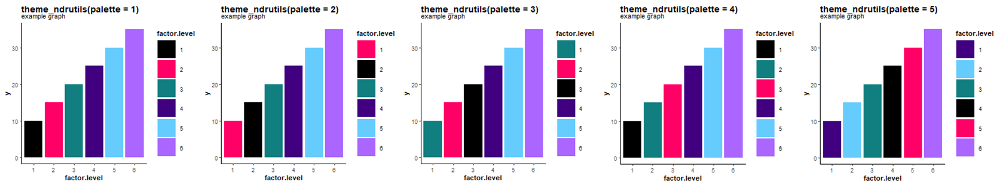
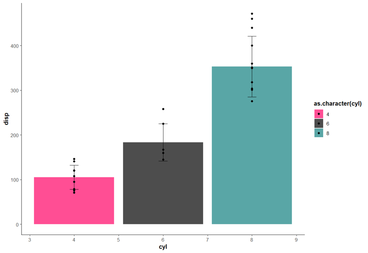

# ndrutils <small>(Medium-throughput plate utilities)</small>

**ndrutils** is a lightweight toolkit for people who work with medium throughput data.  
It streamlines repetitive chores:

* **Parsing instrument output**  
  &nbsp;&nbsp;• *HP/Tecan d300* “Print Map” XML ⇒ tidy table  
  &nbsp;&nbsp;• *Revvity Envision Nexus* plate reader CSV ⇒ tidy table

* **Cleaning edge artefacts** with `drop_edges()`.

* **Publishing‑ready plots** `theme_ndrutils` as a color‑blind‑safe variant of `ggplot2::theme_classic()`.

---

## Installation

```r
if (!requireNamespace("remotes", quietly = TRUE))
  install.packages("remotes")

remotes::install_github("dmontagna13/ndrutils")   # change to your user/org

```

  |Function              |What it does|Key arguments|
  | --- | --- | --- |
  |parse_printmap()|Parse HP / Tecan d300 XML reports and return one row per well with plate, well, compound, concentration, and DMSO %| `file, add_prefix = "BIO-"` (`FALSE` to suppress)|
  |parse_plate_kaleido() | Convert a Revvity Envision Nexus CSV export (96‑ or 384‑well) into a long table (file, plate, well, value)|`file_path, plate.number = 1`|
  |drop_edges()|Remove perimeter wells (rows A/P, columns 1/24 by default) to avoid edge effects|`.data, row_edges, col_edges, apply_to_plates, drop = TRUE`|
  |theme_ndrutils()|A ggplot2 theme + colour‑blind‑safe palette (GraphPad Prism 9 scheme)|`palette = p` where p = numbers 1‑5 or a custom vector|
  |mean_sd()|Helper for `ggplot2::stat_summary()` that returns mean ± SD|`x` (numeric vector)|


## Example Use

### 1. `parse_printmap()`

`parse_printmap()` reads the `Tabular` worksheet in the d300 XML print report, normalizes column names.

As default behavior, any compounds annotated with a number-only name will get the prefix "BIO-" added. This can be changed with argument `add_prefix`. `add_prefix` can be set to any string, or can be set to `FALSE` if you want bare numbers left alone.

```r
pm <- parse_printmap("Plate_Map_Run42.xml",
                     add_prefix = "CMPD-")   # custom prefix
head(pm)
```


### 2. `parse_plate_kaleido`

`parse_plate_kaleido()` is designed to process the default `.csv` export format from a Revvity Envision Nexus plate reader, where measured values are laid out in a matrix that mirrors the physical layout of the assay plate. This function reshapes the grid into a tidy, long-format table with one row per well, including plate number, well ID, and measured value.

Although it was written for Envision Nexus output, it may also work with other plate reader software provided that:

The input is a .csv file (not `.tsv`, `.txt`, `.xls`, or `.xlsx`);

The matrix includes row labels A–H (for 96-well) or A–P (for 384-well), and column headers 1–12 or 1–24, respectively.

Currently, this function supports 96-well and 384-well formats only. It's a quick way to bring raw plate reader output into a format suitable for merging, plotting, or further statistical analysis.

As written, it imports a single plate:


```r

pr <- parse_plate_kaleido("readout_42.csv", plate.number = 1)
head(pr)

#        file     plate well val
#1 readout_42.csv     1  A01 652
#2 readout_42.csv     1  B01 526
#3 readout_42.csv     1  C01 476
#4 readout_42.csv     1  D01 538
#5 readout_42.csv     1  E01 520
#6 readout_42.csv     1  F01 391

```

However, if you have a dataframe with columns `file` and `plate`, it can be used as .x inside `purrr::pmap_dfr(.x, parse_plate_kaleido)` to import many plates and combine them into a single dataframe:

```r
plate.list <- data.frame(plate = c(1, 2, 3, 4, 5),
file = c("plate1.csv", "plate2.csv", "plate3.csv", "plate4.csv", "plate5.csv"))

head(plate.list)

#  plate file      
#1     1 plate1.csv
#2     2 plate2.csv
#3     3 plate3.csv
#4     4 plate4.csv
#5     5 plate5.csv

pr <- purrr::pmap_dfr(plate.file.list, parse_plate_kaleido) # Parses plates 1-5 into a single dataframe.

```


### 3. `drop_edges`

Edge effects are a common problem in tissue cultured assays. drop_edges() is written to quickly drop these wells from the dataset before further summarization.

```r
clean <- drop_edges(pr)                               # default removes rows A/P & cols 1/24 from all plates
clean <- drop_edges(pr,
                    apply_to_plates = c(4, 5))        # removes rows A/P & cols 1/24 from plates 4 & 5 only
                    
clean <- drop_edges(pr,
                    apply_to_plates = c(1, 2),
                    col_edges = c(1, 12),
                    row_edges = c("A", "H"))          # removes rows A/H & cols 1/12 from plates 1 & 2 only

```

As of the current release, you can't drop different sets of rows/columns on different plates with the same line.
You shouldn't have any trouble stringing them together in an tidyverse-style pipe though.

### 4. `theme_ndrutils()`
theme_ndrutils is a ggplot theme with some custom arguments. It is essentially the same as theme_classic() with the "colorblind safe" colors from Graphpad Prism 9. It lets the user quickly change the order of the color assignments.

```r
ggplot(df, aes(x = factor.level, y = y, fill = factor.level))+
    geom_col()+
    theme_ndrutils(base_size = 6, palette = 1)+
    labs(title = paste0("theme_ndrutils(palette = ", 1, ")"),
         subtitle = "example graph")
```
<a href="theme_ndrutils.png"></a>


### 5. `mean_sd()`

`mean_sd()` was written to be called from within a ggplot2 pipe. Usually, the input dataframe to ggplot will be either mean/sd values OR all values per condition. Rather than preparing two dataframes for a single plot, mean_sd() allows you to generate a temporary table within the pipe to calculate mean/sd. Example below:

```r
ggplot(mtcars, aes(x = cyl, y = disp, fill = as.character(cyl))) +
    stat_summary(fun = mean, geom = "bar", alpha = 0.7) +
    stat_summary(fun.data = mean_sd, geom = "errorbar", width = 0.2) +
    geom_point()+
    theme_ndrutils(palette = 2)
```
<a href="mean_sd_mtcars.png"></a>
